# Testing

> [!NOTE]  
> Return back to the [README.md](README.md) file.

## Code Validation

### HTML

I have used the recommended [HTML W3C Validator](https://validator.w3.org) to validate all of my HTML files.

| Directory               | File                                                                                                                          | URL                                                                 | Screenshot                                                                 | Notes                                                                                                                                                                                                               |
| ----------------------- | ----------------------------------------------------------------------------------------------------------------------------- | ------------------------------------------------------------------- | -------------------------------------------------------------------------- | ------------------------------------------------------------------------------------------------------------------------------------------------------------------------------------------------------------------- |
| Home                    | [index.html](https://github.com/EllisBale/stay_hollow/blob/main/home/templates/home/index.html)                               | [Link](https://stay-hollow-9b3793ea0059.herokuapp.com/)             | 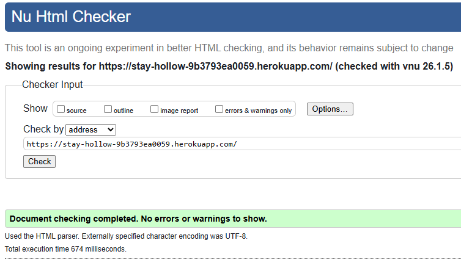            | No Issues                                                                                                                                                                                                           |
| Listings                | [property_list.html](https://github.com/EllisBale/stay_hollow/blob/main/listings/templates/listings/property_list.html)       | [Link](https://stay-hollow-9b3793ea0059.herokuapp.com/listings/)    | 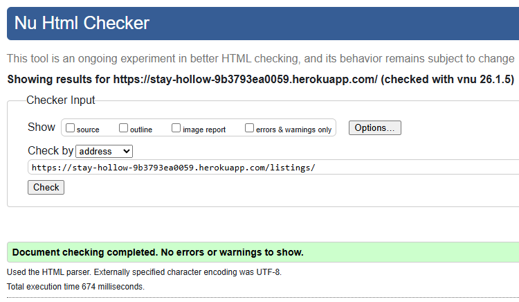         | No Issues                                                                                                                                                                                                           |
| Listing Details         | [property_detail.html](https://github.com/EllisBale/stay_hollow/blob/main/listings/templates/listings/property_detail.html)   | [Link](https://stay-hollow-9b3793ea0059.herokuapp.com/listings/16/) | 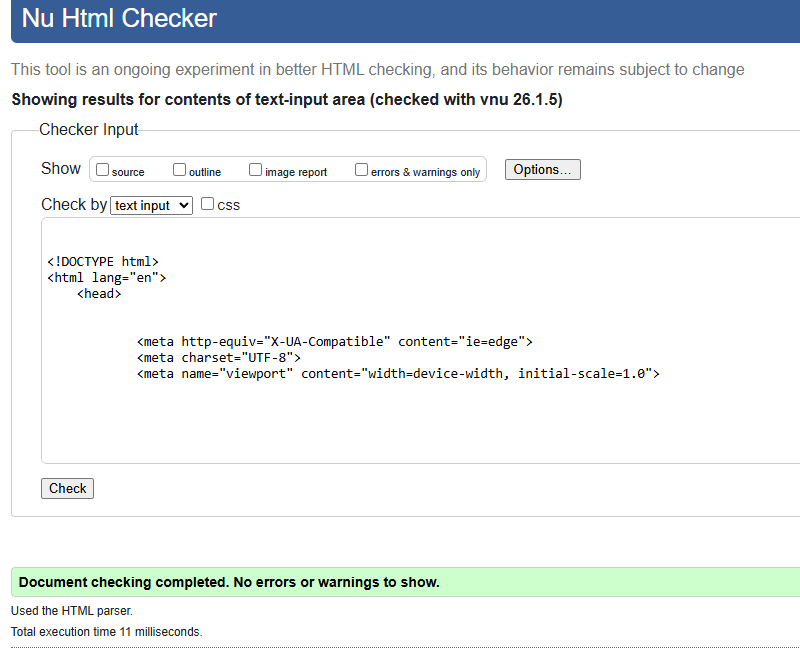 | No Issues                                                                                                                                                                                                           |
| Contact                 | [contact.html](https://github.com/EllisBale/stay_hollow/blob/main/home/templates/home/contact.html)                           | [Link](https://stay-hollow-9b3793ea0059.herokuapp.com/contact/)     | 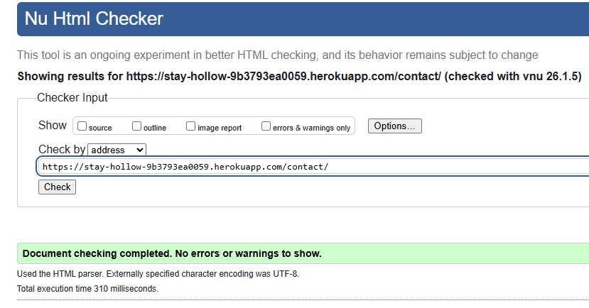         | No Issues                                                                                                                                                                                                           |
| About                   | [about.html](https://github.com/EllisBale/stay_hollow/blob/main/home/templates/home/about.html)                               | [Link](https://stay-hollow-9b3793ea0059.herokuapp.com/about/)       | 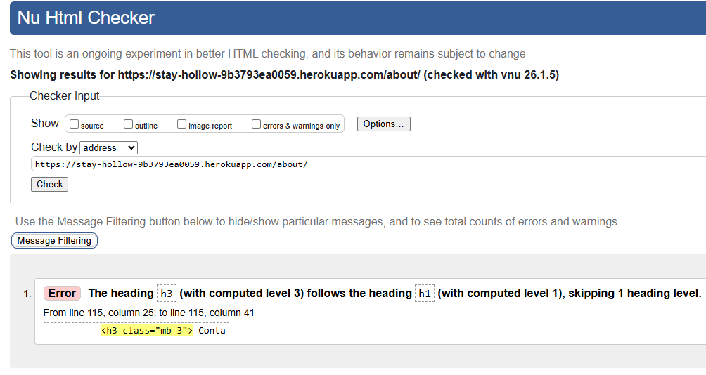           | Only one issue with the footer heading structure. I can't change the footer heading because it's in my base.html and it will effect other pages.                                                                    |
| Order History           | [index.html](https://github.com/EllisBale/stay_hollow/blob/main/user_account/templates/user_account/order_history.html)       | No Link                                                             | 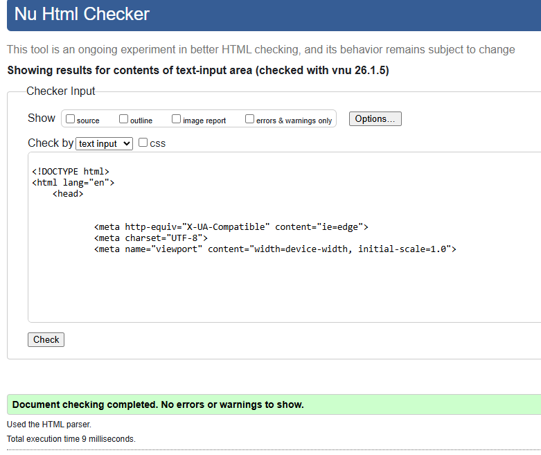   | No Issues                                                                                                                                                                                                           |
| Booking Create Date     | [booking.html](https://github.com/EllisBale/stay_hollow/blob/main/bookings/templates/bookings/booking.html)                   | No Link                                                             | 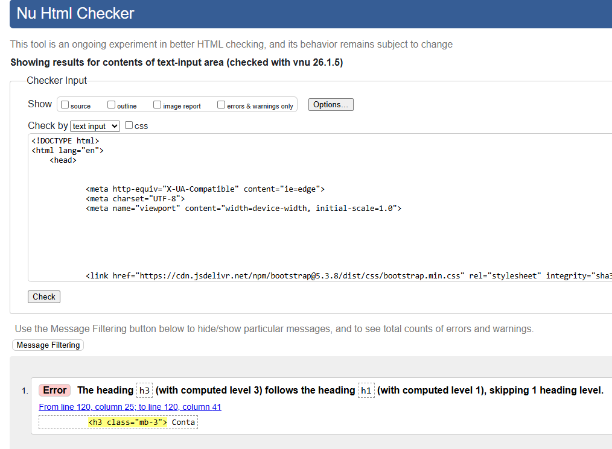         | Only one issue with the footer heading structure. I can't change the footer heading because it's in my base.html and it will effect other pages.                                                                    |
| Checkout                | [checkout.html](https://github.com/EllisBale/stay_hollow/blob/main/checkout/templates/checkout/checkout.html)                 | No Link                                                             | 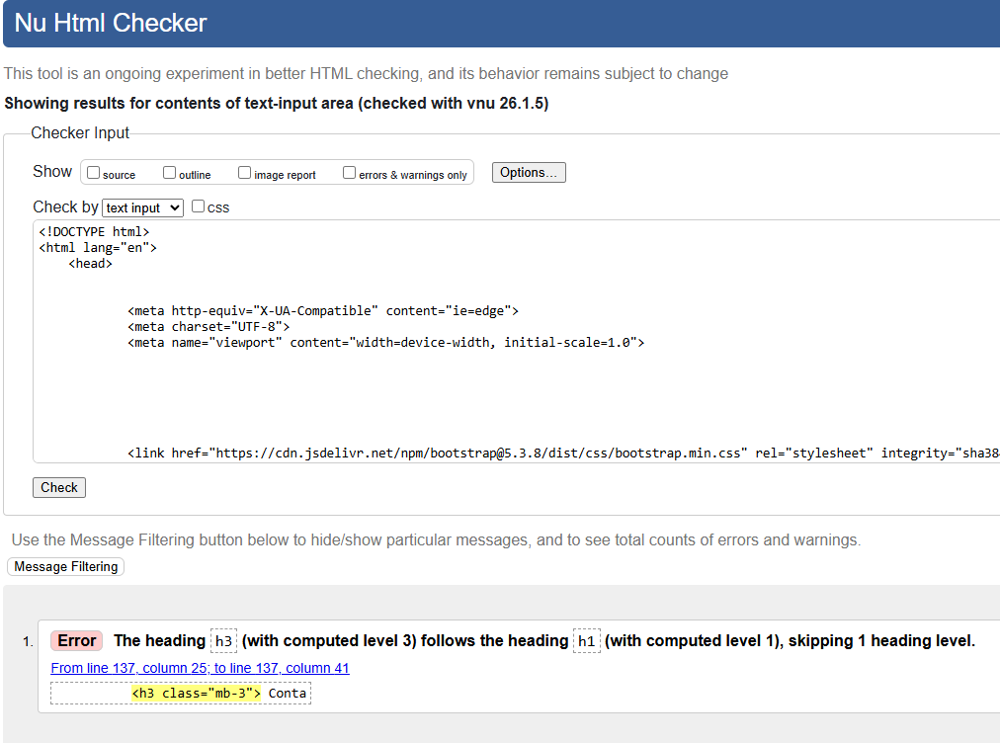        | Only one issue with the footer heading structure. I can't change the footer heading because it's in my base.html and it will effect other pages.                                                                    |
| Checkout Success        | [checkout_success.html](https://github.com/EllisBale/stay_hollow/blob/main/checkout/templates/checkout/checkout_success.html) | No Link                                                             | 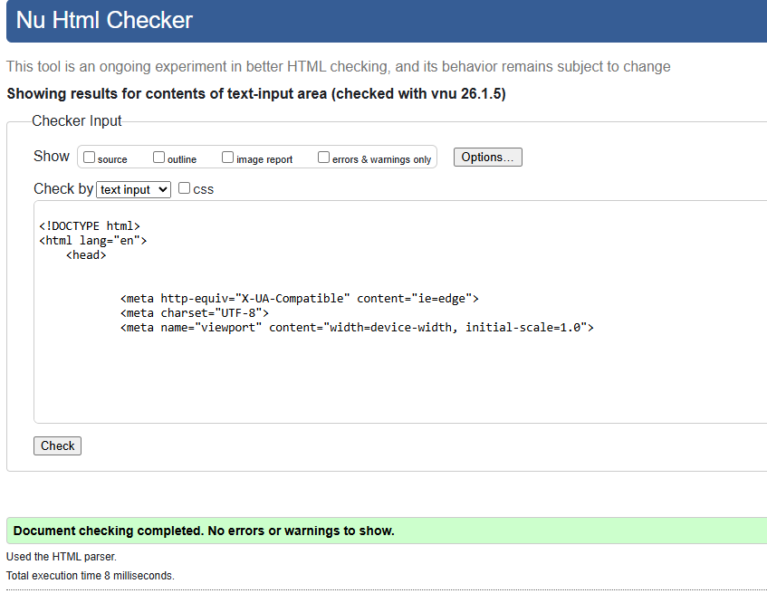         | No Issues                                                                                                                                                                                                           |
| Management              | [management.html](https://github.com/EllisBale/stay_hollow/blob/main/management/templates/management/management.html)         | No Link                                                             |       | No Issues                                                                                                                                                                                                           |
| Management Listing list | [listings_list.html](https://github.com/EllisBale/stay_hollow/blob/main/management/templates/management/listings_list.html)   | No Link                                                             | 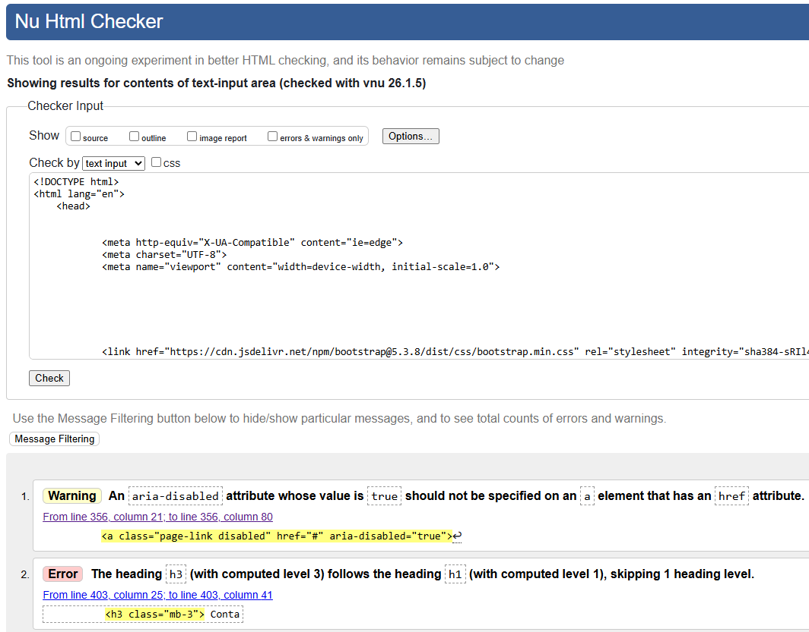  | Issue with the footer heading structure. I can't change the footer heading because it's in my base.html and it will effect other pages. I have another issue with the pagination which I tried to fix but couldn't. |
| Management Booking list | [booking_list.html](https://github.com/EllisBale/stay_hollow/blob/main/management/templates/management/booking_list.html)     | No Link                                                             | 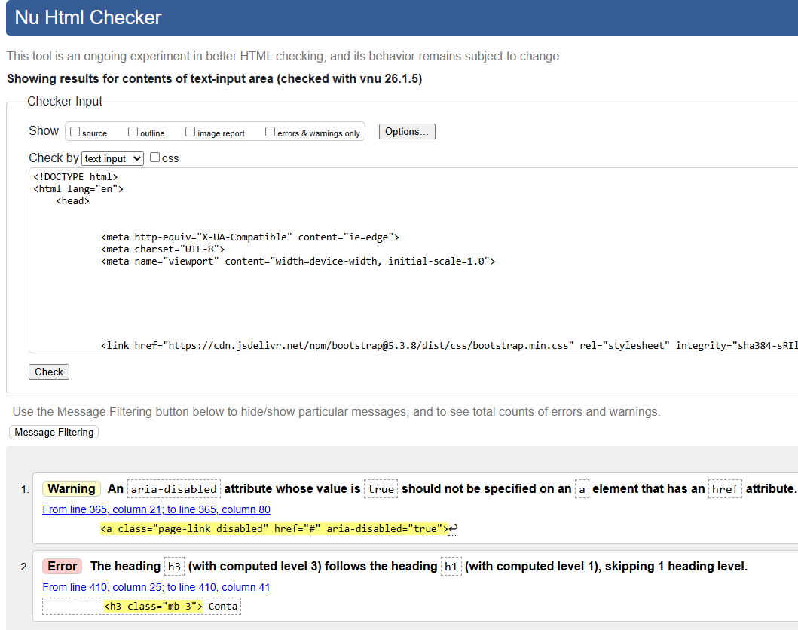 | Issue with the footer heading structure. I can't change the footer heading because it's in my base.html and it will effect other pages. I have another issue with the pagination which I tried to fix but couldn't. |
| Management User list    | [user_list.html](https://github.com/EllisBale/stay_hollow/blob/main/management/templates/management/user_list.html)           | No Link                                                             | 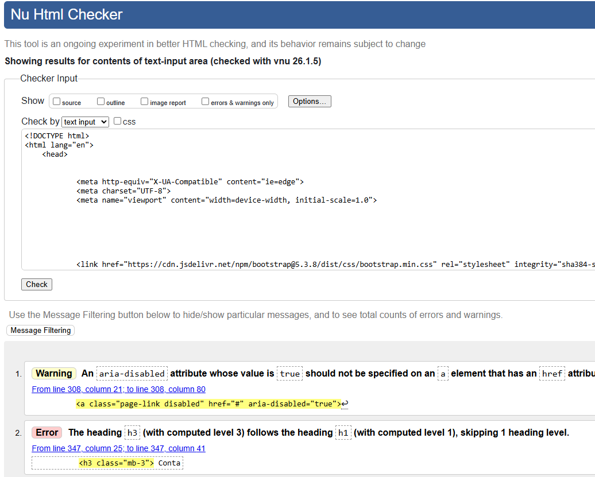    | Issue with the footer heading structure. I can't change the footer heading because it's in my base.html and it will effect other pages. I have another issue with the pagination which I tried to fix but couldn't. |
| Management Review list  | [reviews_list.html](https://github.com/EllisBale/stay_hollow/blob/main/management/templates/management/reviews_list.html)     | No Link                                                             | 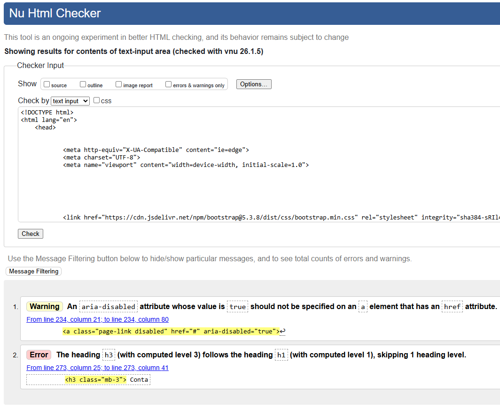  | Issue with the footer heading structure. I can't change the footer heading because it's in my base.html and it will effect other pages. I have another issue with the pagination which I tried to fix but couldn't. |
| All Manage forms        |                                                                                                                               | No Link                                                             |                                                                            | No Issues on all forms.                                                                                                                                                                                             |

### CSS

I have used the recommended [CSS Jigsaw Validator](https://jigsaw.w3.org/css-validator) to validate all of my CSS files.

| Directory        | File                                                                                                                         | URL                                                                                             | Screenshot                                                      | Notes     |
| ---------------- | ---------------------------------------------------------------------------------------------------------------------------- | ----------------------------------------------------------------------------------------------- | --------------------------------------------------------------- | --------- |
| base.css         | [base.css](https://github.com/EllisBale/stay_hollow/blob/main/static/css/base.css)                                           | [Link](https://stay-hollow-9b3793ea0059.herokuapp.com/static/css/base.css)                      |          | No Issues |
| home.css         | [home.css](https://github.com/EllisBale/stay_hollow/blob/main/home/static/home/css/home.css)                                 | [Link](https://stay-hollow-9b3793ea0059.herokuapp.com/static/home/css/home.css)                 | 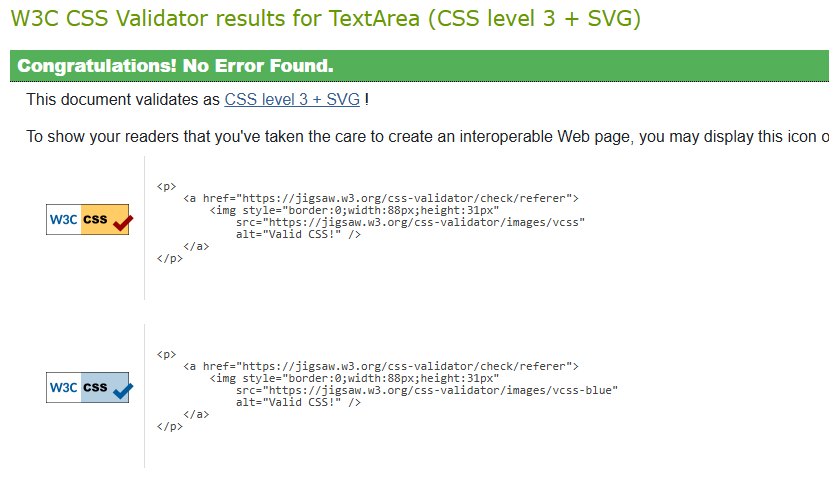         | No Issues |
| listings.css     | [listings.css](https://github.com/EllisBale/stay_hollow/blob/main/listings/static/listings/css/listings.css)                 | [Link](https://stay-hollow-9b3793ea0059.herokuapp.com/static/listings/css/listings.css)         | 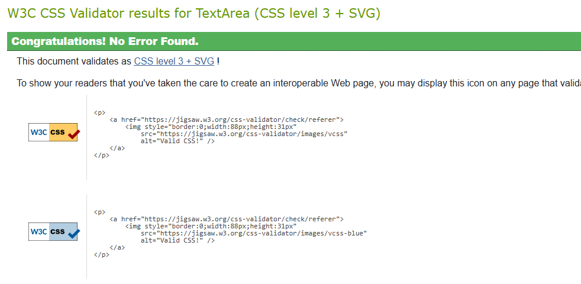      | No Issues |
| manage.css       | [manage.css](https://github.com/EllisBale/stay_hollow/blob/main/management/static/management/css/manage.css)                 | [Link](https://stay-hollow-9b3793ea0059.herokuapp.com/static/management/css/manage.css)         | 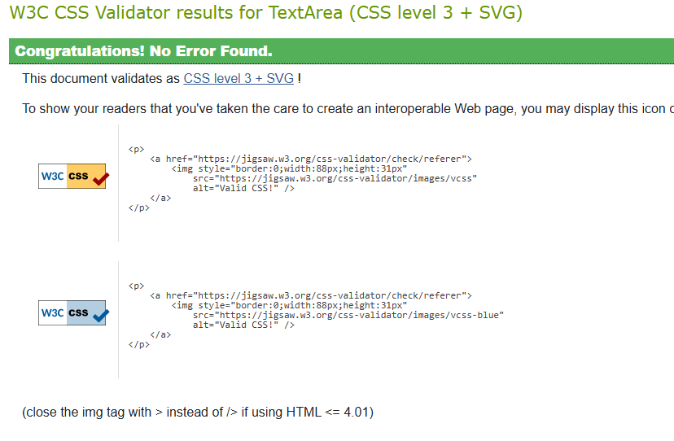       | No Issues |
| user_account.css | [user_account.css](https://github.com/EllisBale/stay_hollow/blob/main/user_account/static/user_account/css/user_account.css) | [Link](https://stay-hollow-9b3793ea0059.herokuapp.com/static/user_account/css/user_account.css) | 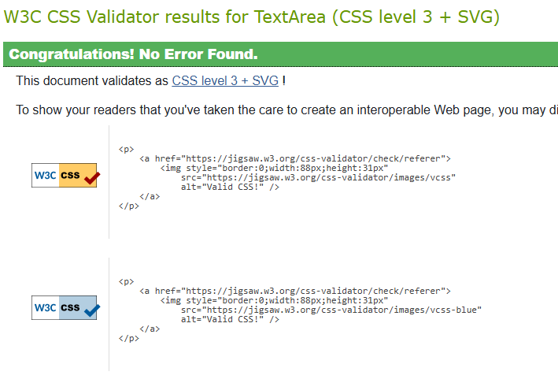 | No Issues |

### JavaScript

I have used the recommended [JShint Validator](https://jshint.com) to validate all of my JS files.

| Directory          | File                                                                                                                    | URL                                                                                          | Screenshot                                                     | Notes     |
| ------------------ | ----------------------------------------------------------------------------------------------------------------------- | -------------------------------------------------------------------------------------------- | -------------------------------------------------------------- | --------- |
| stripe_elements.js | [stripe_elements.js](https://github.com/EllisBale/stay_hollow/blob/main/checkout/static/checkout/js/stripe_elements.js) | [Link](https://stay-hollow-9b3793ea0059.herokuapp.com/static/checkout/js/stripe_elements.js) | 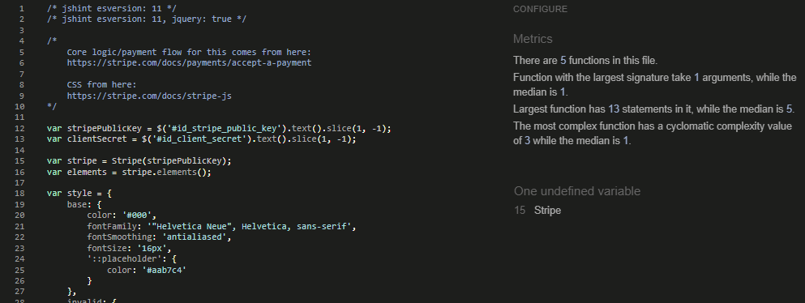  | No Issues |
| home.js            | [home.js](https://github.com/EllisBale/stay_hollow/blob/main/home/static/home/js/home.js)                               | [Link](https://stay-hollow-9b3793ea0059.herokuapp.com/static/home/js/home.js)                | 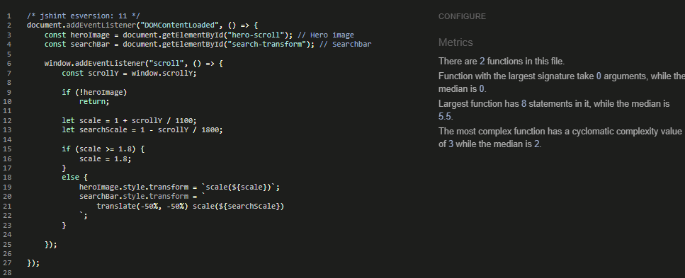    | No Issues |
| listings.js        | [listings.js](https://github.com/EllisBale/stay_hollow/blob/main/listings/static/listings/js/listings.js)               | [Link](https://stay-hollow-9b3793ea0059.herokuapp.com/static/listings/js/listings.js)        | 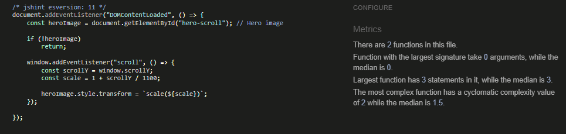 | No Issues |
| manage.js          | [manage.js](https://github.com/EllisBale/stay_hollow/blob/main/management/static/management/js/manage.js)               | [Link](https://stay-hollow-9b3793ea0059.herokuapp.com/static/management/js/manage.js)        | 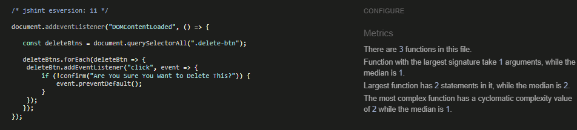  | No Issues |
| base.js            | [base.js](https://github.com/EllisBale/stay_hollow/blob/main/static/js/base.js)                                         | [Link](https://stay-hollow-9b3793ea0059.herokuapp.com/static/js/base.js)                     | 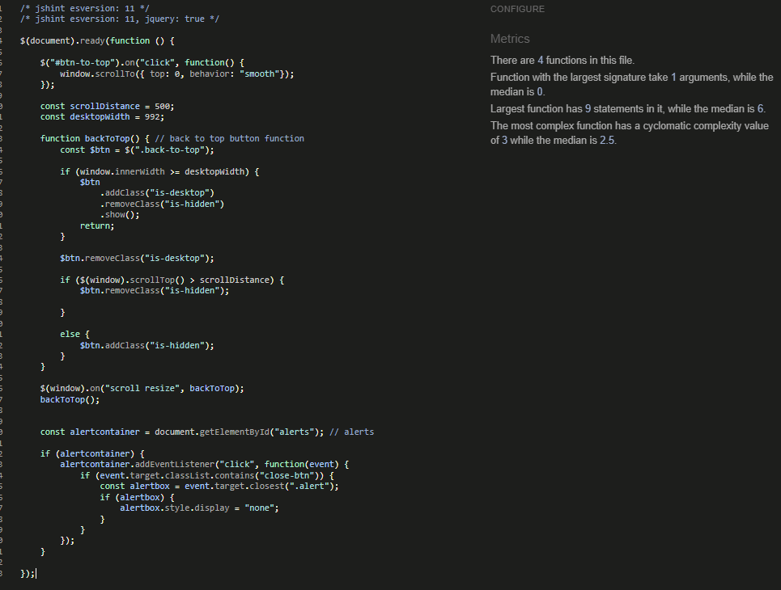    | No Issues |

### Python

I have used the recommended [PEP8 CI Python Linter](https://pep8ci.herokuapp.com) to validate all of my Python files.

| Directory    | File                                                                                                 | URL                                                                                                                                   | Screenshot                                                                   | Notes                                    |
| ------------ | ---------------------------------------------------------------------------------------------------- | ------------------------------------------------------------------------------------------------------------------------------------- | ---------------------------------------------------------------------------- | ---------------------------------------- |
| bookings     | [admin.py](https://github.com/EllisBale/stay_hollow/blob/main/bookings/admin.py)                     | [PEP8 CI Link](https://pep8ci.herokuapp.com/https://raw.githubusercontent.com/EllisBale/stay_hollow/main/bookings/admin.py)           | 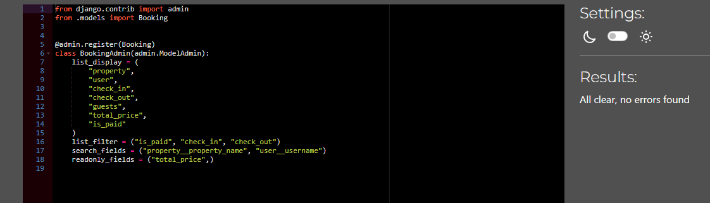            |                                          |
| bookings     | [forms.py](https://github.com/EllisBale/stay_hollow/blob/main/bookings/forms.py)                     | [PEP8 CI Link](https://pep8ci.herokuapp.com/https://raw.githubusercontent.com/EllisBale/stay_hollow/main/bookings/forms.py)           | 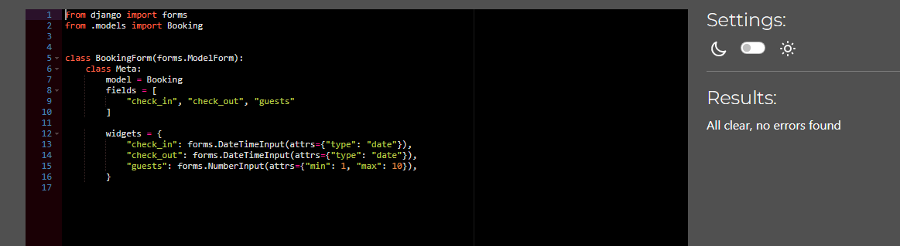            |                                          |
| bookings     | [models.py](https://github.com/EllisBale/stay_hollow/blob/main/bookings/models.py)                   | [PEP8 CI Link](https://pep8ci.herokuapp.com/https://raw.githubusercontent.com/EllisBale/stay_hollow/main/bookings/models.py)          | 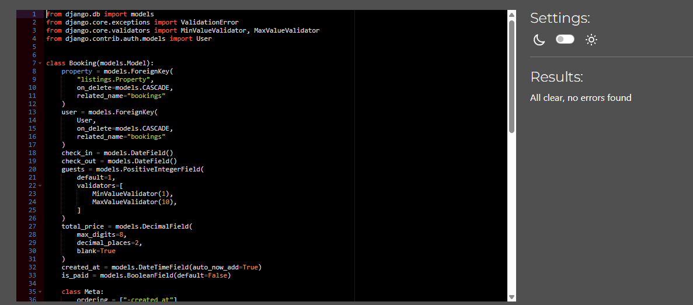            |                                          |
| bookings     | [test_forms.py](https://github.com/EllisBale/stay_hollow/blob/main/bookings/test_forms.py)           | [PEP8 CI Link](https://pep8ci.herokuapp.com/https://raw.githubusercontent.com/EllisBale/stay_hollow/main/bookings/test_forms.py)      | 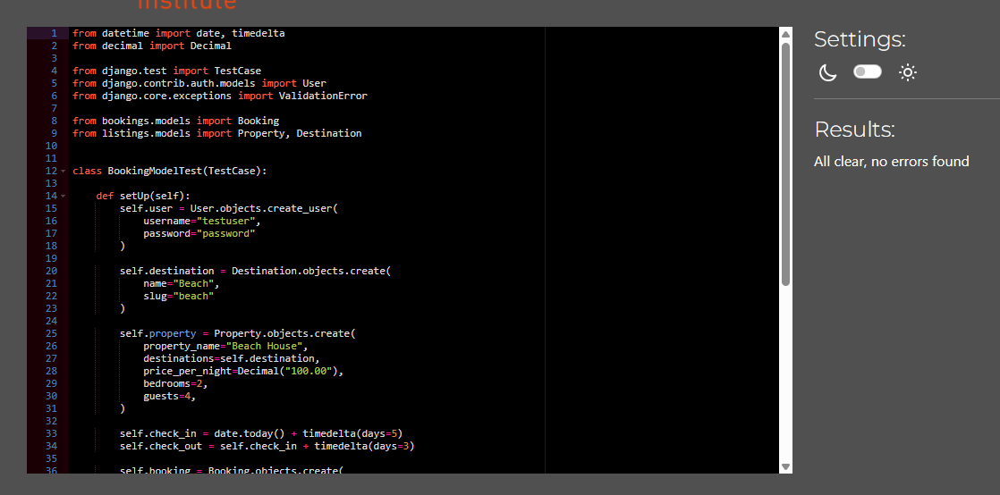        |                                          |
| bookings     | [test_models.py](https://github.com/EllisBale/stay_hollow/blob/main/bookings/test_models.py)         | [PEP8 CI Link](https://pep8ci.herokuapp.com/https://raw.githubusercontent.com/EllisBale/stay_hollow/main/bookings/test_models.py)     | 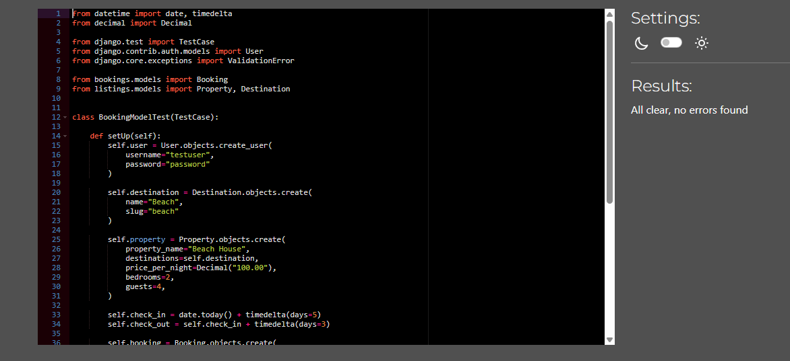       |                                          |
| bookings     | [test_views.py](https://github.com/EllisBale/stay_hollow/blob/main/bookings/test_views.py)           | [PEP8 CI Link](https://pep8ci.herokuapp.com/https://raw.githubusercontent.com/EllisBale/stay_hollow/main/bookings/test_views.py)      | 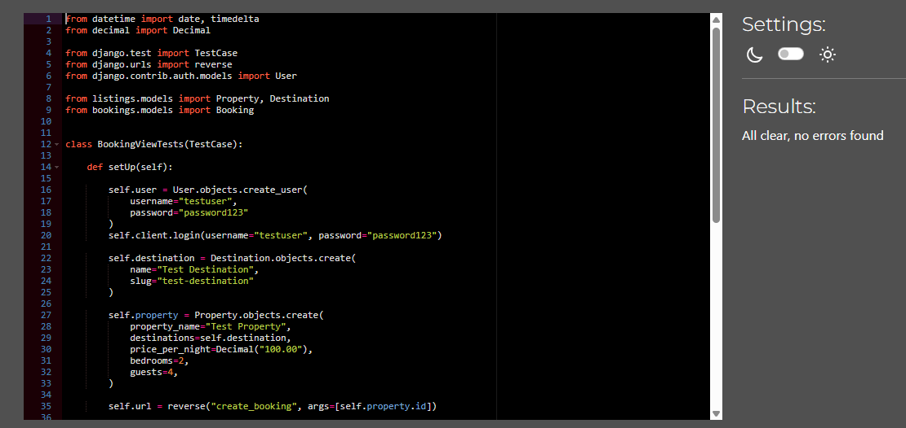       |                                          |
| bookings     | [tests.py](https://github.com/EllisBale/stay_hollow/blob/main/bookings/tests.py)                     | [PEP8 CI Link](https://pep8ci.herokuapp.com/https://raw.githubusercontent.com/EllisBale/stay_hollow/main/bookings/tests.py)           | 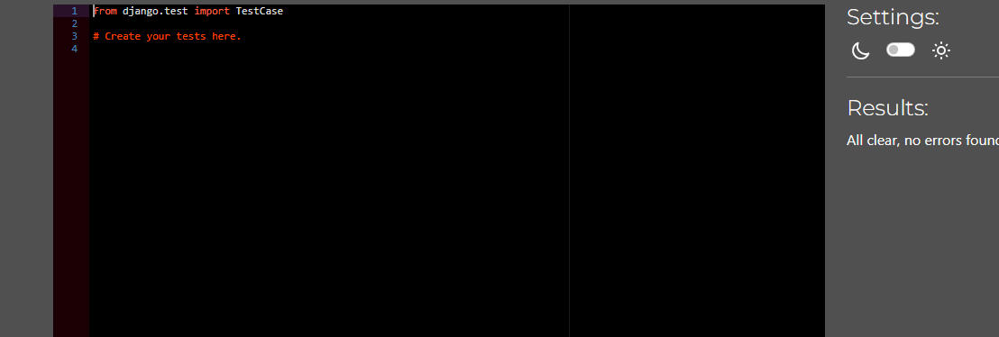             |                                          |
| bookings     | [urls.py](https://github.com/EllisBale/stay_hollow/blob/main/bookings/urls.py)                       | [PEP8 CI Link](https://pep8ci.herokuapp.com/https://raw.githubusercontent.com/EllisBale/stay_hollow/main/bookings/urls.py)            | 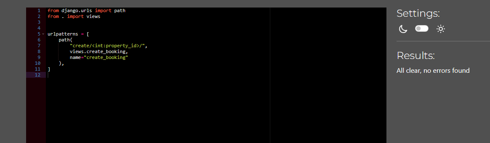              |                                          |
| bookings     | [views.py](https://github.com/EllisBale/stay_hollow/blob/main/bookings/views.py)                     | [PEP8 CI Link](https://pep8ci.herokuapp.com/https://raw.githubusercontent.com/EllisBale/stay_hollow/main/bookings/views.py)           | 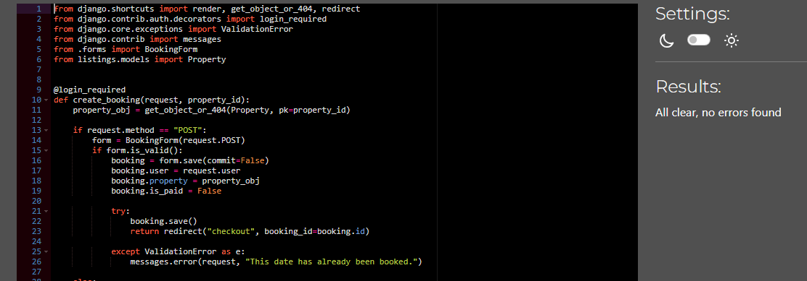             |                                          |
| checkout     | [admin.py](https://github.com/EllisBale/stay_hollow/blob/main/checkout/admin.py)                     | [PEP8 CI Link](https://pep8ci.herokuapp.com/https://raw.githubusercontent.com/EllisBale/stay_hollow/main/checkout/admin.py)           | 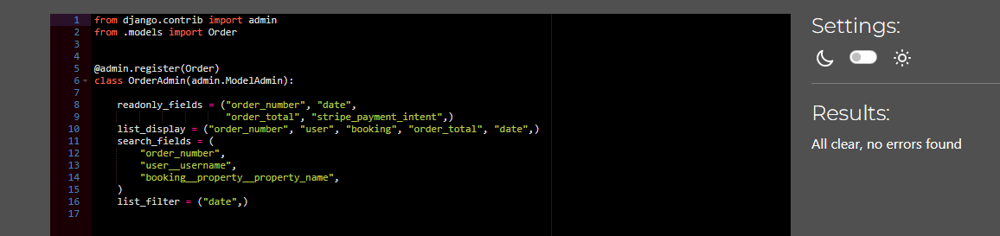            |                                          |
| checkout     | [forms.py](https://github.com/EllisBale/stay_hollow/blob/main/checkout/forms.py)                     | [PEP8 CI Link](https://pep8ci.herokuapp.com/https://raw.githubusercontent.com/EllisBale/stay_hollow/main/checkout/forms.py)           | 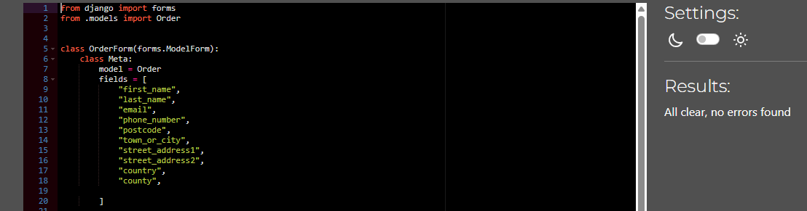            |                                          |
| checkout     | [models.py](https://github.com/EllisBale/stay_hollow/blob/main/checkout/models.py)                   | [PEP8 CI Link](https://pep8ci.herokuapp.com/https://raw.githubusercontent.com/EllisBale/stay_hollow/main/checkout/models.py)          | 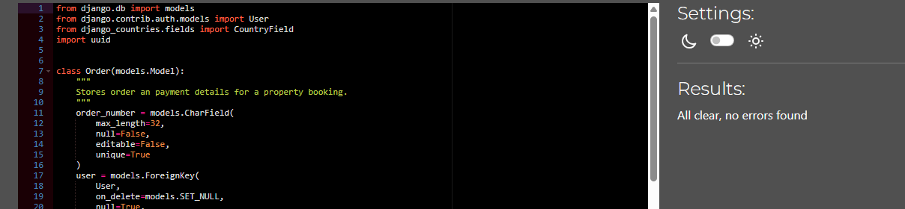           |                                          |
| checkout     | [test_forms.py](https://github.com/EllisBale/stay_hollow/blob/main/checkout/test_forms.py)           | [PEP8 CI Link](https://pep8ci.herokuapp.com/https://raw.githubusercontent.com/EllisBale/stay_hollow/main/checkout/test_forms.py)      | 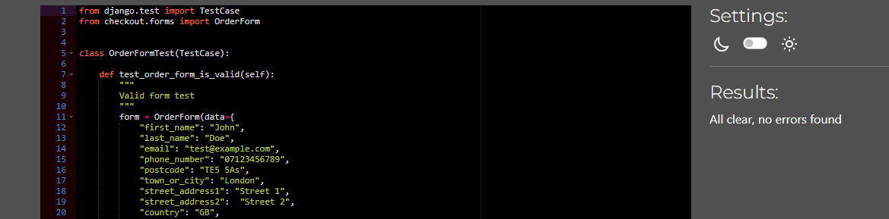       |                                          |
| checkout     | [test_models.py](https://github.com/EllisBale/stay_hollow/blob/main/checkout/test_models.py)         | [PEP8 CI Link](https://pep8ci.herokuapp.com/https://raw.githubusercontent.com/EllisBale/stay_hollow/main/checkout/test_models.py)     | 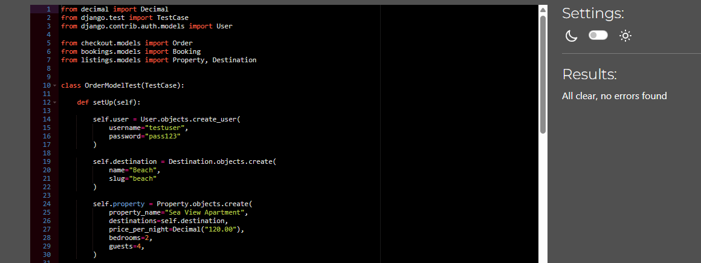       |                                          |
| checkout     | [test_views.py](https://github.com/EllisBale/stay_hollow/blob/main/checkout/test_views.py)           | [PEP8 CI Link](https://pep8ci.herokuapp.com/https://raw.githubusercontent.com/EllisBale/stay_hollow/main/checkout/test_views.py)      | 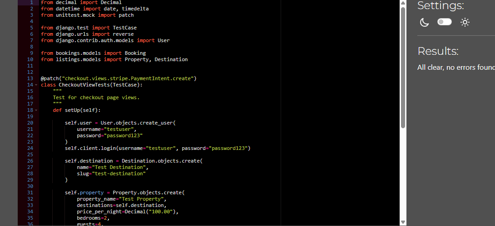       |                                          |
| checkout     | [tests.py](https://github.com/EllisBale/stay_hollow/blob/main/checkout/tests.py)                     | [PEP8 CI Link](https://pep8ci.herokuapp.com/https://raw.githubusercontent.com/EllisBale/stay_hollow/main/checkout/tests.py)           | 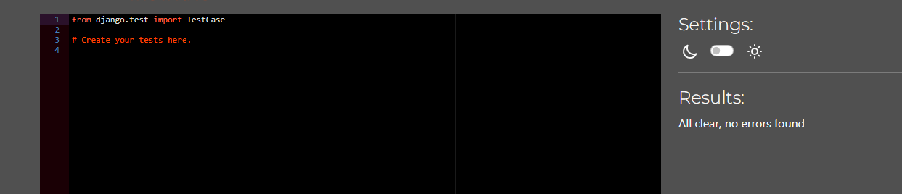            |                                          |
| checkout     | [urls.py](https://github.com/EllisBale/stay_hollow/blob/main/checkout/urls.py)                       | [PEP8 CI Link](https://pep8ci.herokuapp.com/https://raw.githubusercontent.com/EllisBale/stay_hollow/main/checkout/urls.py)            | 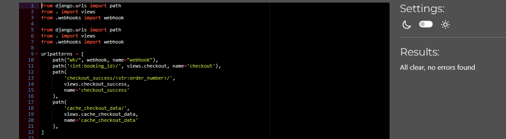              |                                          |
| checkout     | [views.py](https://github.com/EllisBale/stay_hollow/blob/main/checkout/views.py)                     | [PEP8 CI Link](https://pep8ci.herokuapp.com/https://raw.githubusercontent.com/EllisBale/stay_hollow/main/checkout/views.py)           | 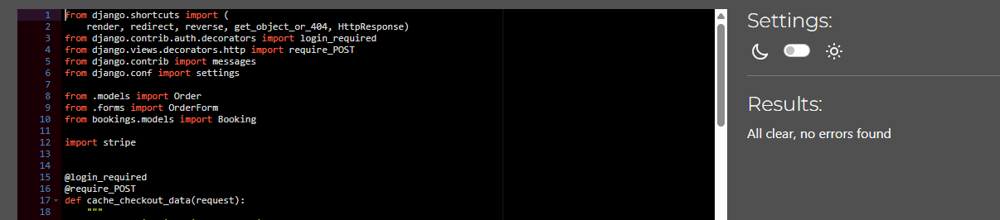            |                                          |
| checkout     | [webhook_handler.py](https://github.com/EllisBale/stay_hollow/blob/main/checkout/webhook_handler.py) | [PEP8 CI Link](https://pep8ci.herokuapp.com/https://raw.githubusercontent.com/EllisBale/stay_hollow/main/checkout/webhook_handler.py) | 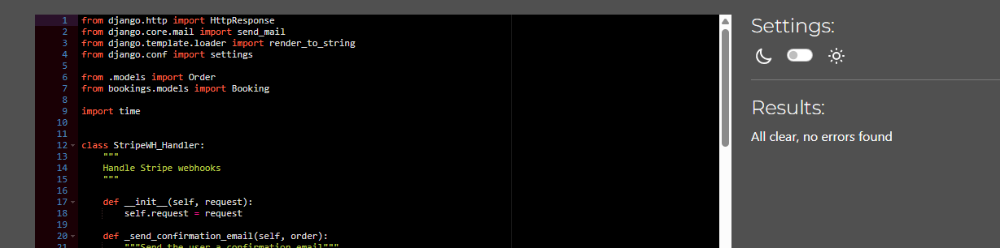 |                                          |
| checkout     | [webhooks.py](https://github.com/EllisBale/stay_hollow/blob/main/checkout/webhooks.py)               | [PEP8 CI Link](https://pep8ci.herokuapp.com/https://raw.githubusercontent.com/EllisBale/stay_hollow/main/checkout/webhooks.py)        | 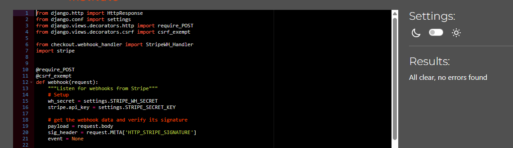         |                                          |
| home         | [admin.py](https://github.com/EllisBale/stay_hollow/blob/main/home/admin.py)                         | [PEP8 CI Link](https://pep8ci.herokuapp.com/https://raw.githubusercontent.com/EllisBale/stay_hollow/main/home/admin.py)               | 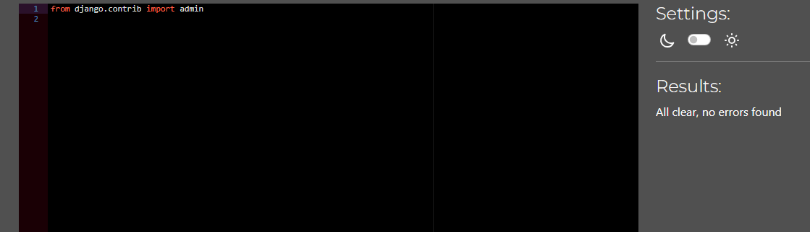                |                                          |
| home         | [models.py](https://github.com/EllisBale/stay_hollow/blob/main/home/models.py)                       | [PEP8 CI Link](https://pep8ci.herokuapp.com/https://raw.githubusercontent.com/EllisBale/stay_hollow/main/home/models.py)              |                |                                          |
| home         | [test_views.py](https://github.com/EllisBale/stay_hollow/blob/main/home/test_views.py)               | [PEP8 CI Link](https://pep8ci.herokuapp.com/https://raw.githubusercontent.com/EllisBale/stay_hollow/main/home/test_views.py)          | 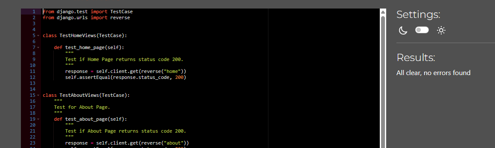           |                                          |
| home         | [tests.py](https://github.com/EllisBale/stay_hollow/blob/main/home/tests.py)                         | [PEP8 CI Link](https://pep8ci.herokuapp.com/https://raw.githubusercontent.com/EllisBale/stay_hollow/main/home/tests.py)               | 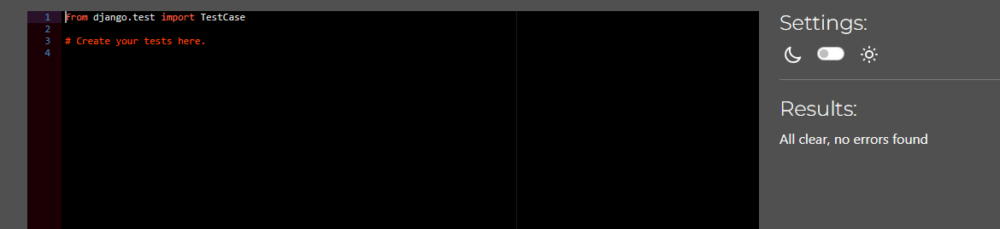                |                                          |
| home         | [urls.py](https://github.com/EllisBale/stay_hollow/blob/main/home/urls.py)                           | [PEP8 CI Link](https://pep8ci.herokuapp.com/https://raw.githubusercontent.com/EllisBale/stay_hollow/main/home/urls.py)                | 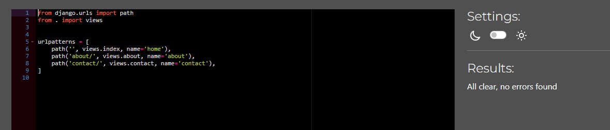                 |                                          |
| home         | [views.py](https://github.com/EllisBale/stay_hollow/blob/main/home/views.py)                         | [PEP8 CI Link](https://pep8ci.herokuapp.com/https://raw.githubusercontent.com/EllisBale/stay_hollow/main/home/views.py)               | 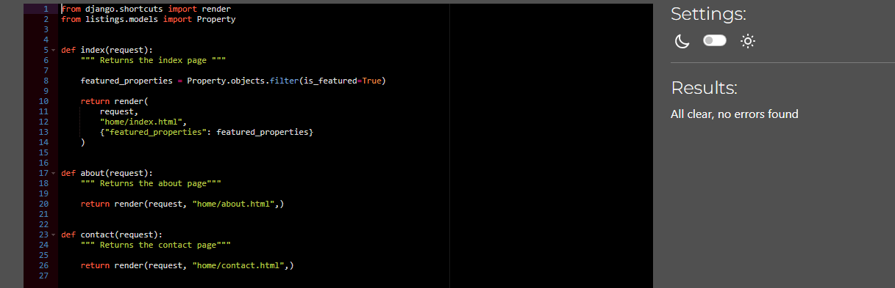                |                                          |
| listings     | [admin.py](https://github.com/EllisBale/stay_hollow/blob/main/listings/admin.py)                     | [PEP8 CI Link](https://pep8ci.herokuapp.com/https://raw.githubusercontent.com/EllisBale/stay_hollow/main/listings/admin.py)           | 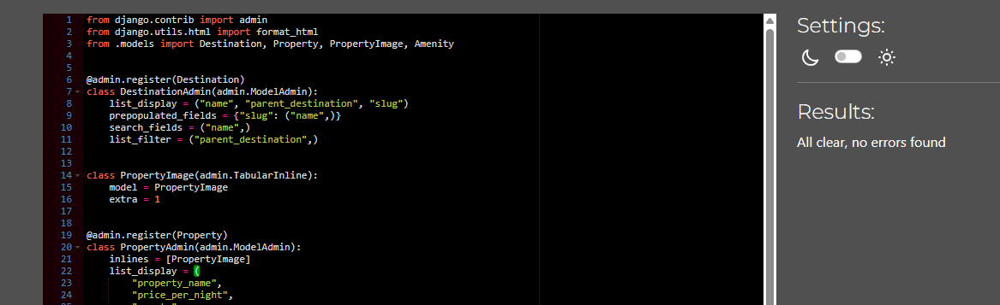            |                                          |
| listings     | [models.py](https://github.com/EllisBale/stay_hollow/blob/main/listings/models.py)                   | [PEP8 CI Link](https://pep8ci.herokuapp.com/https://raw.githubusercontent.com/EllisBale/stay_hollow/main/listings/models.py)          | 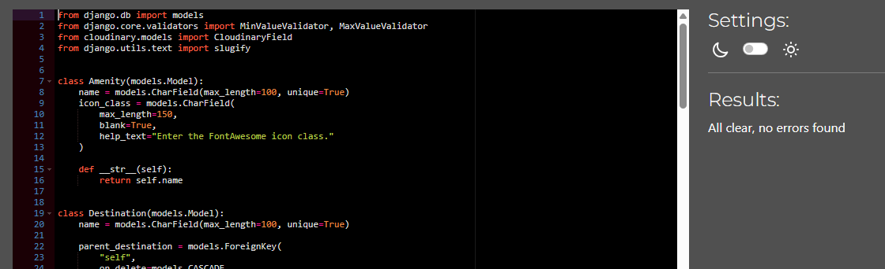           |                                          |
| listings     | [test_models.py](https://github.com/EllisBale/stay_hollow/blob/main/listings/test_models.py)         | [PEP8 CI Link](https://pep8ci.herokuapp.com/https://raw.githubusercontent.com/EllisBale/stay_hollow/main/listings/test_models.py)     | 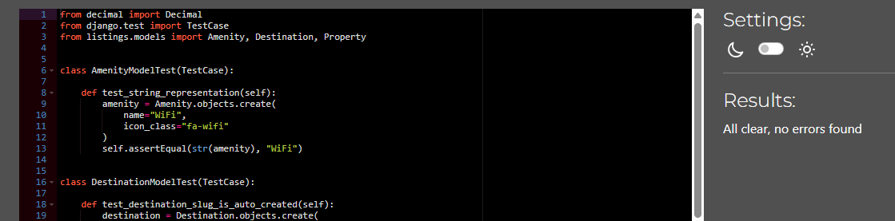      |                                          |
| listings     | [test_views.py](https://github.com/EllisBale/stay_hollow/blob/main/listings/test_views.py)           | [PEP8 CI Link](https://pep8ci.herokuapp.com/https://raw.githubusercontent.com/EllisBale/stay_hollow/main/listings/test_views.py)      |        |                                          |
| listings     | [tests.py](https://github.com/EllisBale/stay_hollow/blob/main/listings/tests.py)                     | [PEP8 CI Link](https://pep8ci.herokuapp.com/https://raw.githubusercontent.com/EllisBale/stay_hollow/main/listings/tests.py)           |             |                                          |
| listings     | [urls.py](https://github.com/EllisBale/stay_hollow/blob/main/listings/urls.py)                       | [PEP8 CI Link](https://pep8ci.herokuapp.com/https://raw.githubusercontent.com/EllisBale/stay_hollow/main/listings/urls.py)            |              |                                          |
| listings     | [views.py](https://github.com/EllisBale/stay_hollow/blob/main/listings/views.py)                     | [PEP8 CI Link](https://pep8ci.herokuapp.com/https://raw.githubusercontent.com/EllisBale/stay_hollow/main/listings/views.py)           |             | Tried to shorten it but it's too nested. |
|              | [manage.py](https://github.com/EllisBale/stay_hollow/blob/main/manage.py)                            | [PEP8 CI Link](https://pep8ci.herokuapp.com/https://raw.githubusercontent.com/EllisBale/stay_hollow/main/manage.py)                   |                     |                                          |
| management   | [admin.py](https://github.com/EllisBale/stay_hollow/blob/main/management/admin.py)                   | [PEP8 CI Link](https://pep8ci.herokuapp.com/https://raw.githubusercontent.com/EllisBale/stay_hollow/main/management/admin.py)         |               |                                          |
| management   | [forms.py](https://github.com/EllisBale/stay_hollow/blob/main/management/forms.py)                   | [PEP8 CI Link](https://pep8ci.herokuapp.com/https://raw.githubusercontent.com/EllisBale/stay_hollow/main/management/forms.py)         |               |                                          |
| management   | [models.py](https://github.com/EllisBale/stay_hollow/blob/main/management/models.py)                 | [PEP8 CI Link](https://pep8ci.herokuapp.com/https://raw.githubusercontent.com/EllisBale/stay_hollow/main/management/models.py)        |              |                                          |
| management   | [test_forms.py](https://github.com/EllisBale/stay_hollow/blob/main/management/test_forms.py)         | [PEP8 CI Link](https://pep8ci.herokuapp.com/https://raw.githubusercontent.com/EllisBale/stay_hollow/main/management/test_forms.py)    |          |                                          |
| management   | [test_views.py](https://github.com/EllisBale/stay_hollow/blob/main/management/test_views.py)         | [PEP8 CI Link](https://pep8ci.herokuapp.com/https://raw.githubusercontent.com/EllisBale/stay_hollow/main/management/test_views.py)    |           |                                          |
| management   | [tests.py](https://github.com/EllisBale/stay_hollow/blob/main/management/tests.py)                   | [PEP8 CI Link](https://pep8ci.herokuapp.com/https://raw.githubusercontent.com/EllisBale/stay_hollow/main/management/tests.py)         |               |                                          |
| management   | [urls.py](https://github.com/EllisBale/stay_hollow/blob/main/management/urls.py)                     | [PEP8 CI Link](https://pep8ci.herokuapp.com/https://raw.githubusercontent.com/EllisBale/stay_hollow/main/management/urls.py)          |                |                                          |
| management   | [views.py](https://github.com/EllisBale/stay_hollow/blob/main/management/views.py)                   | [PEP8 CI Link](https://pep8ci.herokuapp.com/https://raw.githubusercontent.com/EllisBale/stay_hollow/main/management/views.py)         |               |                                          |
| reviews      | [admin.py](https://github.com/EllisBale/stay_hollow/blob/main/reviews/admin.py)                      | [PEP8 CI Link](https://pep8ci.herokuapp.com/https://raw.githubusercontent.com/EllisBale/stay_hollow/main/reviews/admin.py)            |              |                                          |
| reviews      | [forms.py](https://github.com/EllisBale/stay_hollow/blob/main/reviews/forms.py)                      | [PEP8 CI Link](https://pep8ci.herokuapp.com/https://raw.githubusercontent.com/EllisBale/stay_hollow/main/reviews/forms.py)            |               |                                          |
| reviews      | [models.py](https://github.com/EllisBale/stay_hollow/blob/main/reviews/models.py)                    | [PEP8 CI Link](https://pep8ci.herokuapp.com/https://raw.githubusercontent.com/EllisBale/stay_hollow/main/reviews/models.py)           |              |                                          |
| reviews      | [test_forms.py](https://github.com/EllisBale/stay_hollow/blob/main/reviews/test_forms.py)            | [PEP8 CI Link](https://pep8ci.herokuapp.com/https://raw.githubusercontent.com/EllisBale/stay_hollow/main/reviews/test_forms.py)       |          |                                          |
| reviews      | [test_models.py](https://github.com/EllisBale/stay_hollow/blob/main/reviews/test_models.py)          | [PEP8 CI Link](https://pep8ci.herokuapp.com/https://raw.githubusercontent.com/EllisBale/stay_hollow/main/reviews/test_models.py)      |         |                                          |
| reviews      | [test_views.py](https://github.com/EllisBale/stay_hollow/blob/main/reviews/test_views.py)            | [PEP8 CI Link](https://pep8ci.herokuapp.com/https://raw.githubusercontent.com/EllisBale/stay_hollow/main/reviews/test_views.py)       |         |                                          |
| reviews      | [tests.py](https://github.com/EllisBale/stay_hollow/blob/main/reviews/tests.py)                      | [PEP8 CI Link](https://pep8ci.herokuapp.com/https://raw.githubusercontent.com/EllisBale/stay_hollow/main/reviews/tests.py)            |               |                                          |
| reviews      | [urls.py](https://github.com/EllisBale/stay_hollow/blob/main/reviews/urls.py)                        | [PEP8 CI Link](https://pep8ci.herokuapp.com/https://raw.githubusercontent.com/EllisBale/stay_hollow/main/reviews/urls.py)             |               |                                          |
| reviews      | [views.py](https://github.com/EllisBale/stay_hollow/blob/main/reviews/views.py)                      | [PEP8 CI Link](https://pep8ci.herokuapp.com/https://raw.githubusercontent.com/EllisBale/stay_hollow/main/reviews/views.py)            |              |                                          |
| stay_hollow  | [settings.py](https://github.com/EllisBale/stay_hollow/blob/main/stay_hollow/settings.py)            | [PEP8 CI Link](https://pep8ci.herokuapp.com/https://raw.githubusercontent.com/EllisBale/stay_hollow/main/stay_hollow/settings.py)     |                   |                                          |
| stay_hollow  | [urls.py](https://github.com/EllisBale/stay_hollow/blob/main/stay_hollow/urls.py)                    | [PEP8 CI Link](https://pep8ci.herokuapp.com/https://raw.githubusercontent.com/EllisBale/stay_hollow/main/stay_hollow/urls.py)         |                       |                                          |
| user_account | [admin.py](https://github.com/EllisBale/stay_hollow/blob/main/user_account/admin.py)                 | [PEP8 CI Link](https://pep8ci.herokuapp.com/https://raw.githubusercontent.com/EllisBale/stay_hollow/main/user_account/admin.py)       |                 |                                          |
| user_account | [forms.py](https://github.com/EllisBale/stay_hollow/blob/main/user_account/forms.py)                 | [PEP8 CI Link](https://pep8ci.herokuapp.com/https://raw.githubusercontent.com/EllisBale/stay_hollow/main/user_account/forms.py)       |                 |                                          |
| user_account | [models.py](https://github.com/EllisBale/stay_hollow/blob/main/user_account/models.py)               | [PEP8 CI Link](https://pep8ci.herokuapp.com/https://raw.githubusercontent.com/EllisBale/stay_hollow/main/user_account/models.py)      |                |                                          |
| user_account | [test_views.py](https://github.com/EllisBale/stay_hollow/blob/main/user_account/test_views.py)       | [PEP8 CI Link](https://pep8ci.herokuapp.com/https://raw.githubusercontent.com/EllisBale/stay_hollow/main/user_account/test_views.py)  |            |                                          |
| user_account | [tests.py](https://github.com/EllisBale/stay_hollow/blob/main/user_account/tests.py)                 | [PEP8 CI Link](https://pep8ci.herokuapp.com/https://raw.githubusercontent.com/EllisBale/stay_hollow/main/user_account/tests.py)       |                 |                                          |
| user_account | [urls.py](https://github.com/EllisBale/stay_hollow/blob/main/user_account/urls.py)                   | [PEP8 CI Link](https://pep8ci.herokuapp.com/https://raw.githubusercontent.com/EllisBale/stay_hollow/main/user_account/urls.py)        |                  |                                          |
| user_account | [views.py](https://github.com/EllisBale/stay_hollow/blob/main/user_account/views.py)                 | [PEP8 CI Link](https://pep8ci.herokuapp.com/https://raw.githubusercontent.com/EllisBale/stay_hollow/main/user_account/views.py)       |                 |                                          |

## Responsiveness

I've tested my deployed project to check for responsiveness issues.

| Page                | Mobile                                                                      | Tablet                                                                      | Desktop                                                                      | Notes             |
| ------------------- | --------------------------------------------------------------------------- | --------------------------------------------------------------------------- | ---------------------------------------------------------------------------- | ----------------- |
| Register            |         |         |         | Works as expected |
| Login               |            |            |            | Works as expected |
| Logout              |              |             |                 | Works as expected |
| Home                |             |             |             | Works as expected |
| Listings List       |         |         |         | Works as expected |
| Listing Details     |  |  |  | Works as expected |
| Contact             |          |          |          | Works as expected |
| About               |            |            |            | Works as expected |
| Order History       |    |    |    | Works as expected |
| Booking Date        |     |     |      | Works as expected |
| Checkout            |         |         |         | Works as expected |
| Checkout success    |  |  |  | Works as expected |
| Management Overview |         |         |         | Works as expected |
| Management Listings |  |  |  | Works as expected |
| Management Booking  |  |  |  | Works as expected |
| Management Users    |     |     |     | Works as expected |
| Management Reviews  |   |   |   | Works as expected |
| 404                 |              |              |              | Works as expected |

## Browser Compatibility

I've tested my deployed project on multiple browsers to check for compatibility issues.

| Page                | Chrome                                                                    | Firefox                                                                       | Edge                                                                    | Notes             |
| ------------------- | ------------------------------------------------------------------------- | ----------------------------------------------------------------------------- | ----------------------------------------------------------------------- | ----------------- |
| Register            |          |             |          | Works as expected |
| Login               |             |                |             | Works as expected |
| Logout              |            |               |            | Works as expected |
| Home                |              |                 |              | Works as expected |
| Listings List       |          |             |          | Works as expected |
| Listing Details     |   |      |   | Works as expected |
| Contact             |           |              |           | Works as expected |
| About               |             |                |             | Works as expected |
| Order History       |     |        |     | Works as expected |
| Booking Date        |      |         |      | Works as expected |
| Checkout            |          |             |          | Works as expected |
| Checkout success    |  |     |  | Works as expected |
| Management Overview |          |  |          | Works as expected |
| Management Listings |   |  |   | Works as expected |
| Management Booking  |   |      |   | Works as expected |
| Management Users    |      |      |      | Works as expected |
| Management Reviews  |    |    |    | Works as expected |
| 404                 |               |                  |               | Works as expected |

## Lighthouse Audit

⚠️ INSTRUCTIONS ⚠️

Use this space to discuss testing the live/deployed site's Lighthouse Audit reports. Avoid testing the local version (Gitpod/VSCode/etc.), as this can have knock-on effects for performance. If you don't have "Lighthouse" in your Developer Tools, it can be added as an [extension](https://chrome.google.com/webstore/detail/lighthouse/blipmdconlkpinefehnmjammfjpmpbjk).

Unless your project is a single-page application (SPA), you should test Lighthouse Audit results for all of your pages, for both _mobile_ and _desktop_.

**IMPORTANT**: You must provide screenshots of the results, to "prove" that you've actually tested them.

⚠️ --- END --- ⚠️

I've tested my deployed project using the Lighthouse Audit tool to check for any major issues. Some warnings are outside of my control, and mobile results tend to be lower than desktop.

| Page             | Mobile                                                              | Desktop                                                              |
| ---------------- | ------------------------------------------------------------------- | -------------------------------------------------------------------- |
| Register         |          |          |
| Login            |             |             |
| Profile          |           |           |
| Home             |              |              |
| Products         |          |          |
| Product Details  |   |   |
| Bag              |               |               |
| Checkout         |          |          |
| Checkout Success |  |  |
| Add Product      |       |       |
| Edit Product     |      |      |
| Newsletter       |        |        |
| Contact          |           |           |
| 404              |               |               |

## Defensive Programming

Defensive programming was manually tested with the below user acceptance testing:

| Page/Feature        | Expectation                                                                                                                                   | Test                                                                                                                                                                                                                   | Result                                                                                                                                | Screenshot                                                                             |
| ------------------- | --------------------------------------------------------------------------------------------------------------------------------------------- | ---------------------------------------------------------------------------------------------------------------------------------------------------------------------------------------------------------------------- | ------------------------------------------------------------------------------------------------------------------------------------- | -------------------------------------------------------------------------------------- |
| Booking Date        | Feature is expected to allow logged-in users to pick a date.                                                                                  | Click the "Book Now" button on listing details page and pick guests, check-in, and check-out date.                                                                                                                     | Logged-in users can select dates and guests successfully and proceed to checkout page if the dates are available.                     |               |
|                     | Feature is expected to redirect guest users to the login page.                                                                                | Go to listing details page as a guest user and click "Book Now".                                                                                                                                                       | Guest users get redirected to login page successfully.                                                                                |        |
|                     | Feature is expected show error message for already booked dates.                                                                              | Book a date that has already been booked.                                                                                                                                                                              | Error message appears successfully and remains on the booking date page.                                                              |     |
| Checkout            | Feature is expected to allow logged-in users that have picked a valid date to fill in checkout information and proceed onto checkout success. | Fill in all form information to proceed onto checkout success page.                                                                                                                                                    | Users can proceed to checkout success page successfully when all information is entered.                                              |                |
|                     | Feature is expected to restrict checkout to booking owner only.                                                                               | Have multiple logged-in accounts in the browser (Make sure one account is in incognito). Get to the checkout page on one of the accounts and copy the URL onto the other account.                                      | The user gets redirect to a 404 page successfully.                                                                                    |       |
|                     | Feature is expected to only proceed once all required payment information is entered.                                                         | Fill in each required form field one by one and complete payment after form field is filled.                                                                                                                           | The form will alert the user for required form fields to be filled in if left empty.                                                  |           |
|                     | Feature is expected to send a confirmation email after purchase.                                                                              | Complete a purchase and check email inbox.                                                                                                                                                                             | Confirmation email was received with order details.                                                                                   |                   |
| Searchbar           | Feature is expected to allow users to search property names.                                                                                  | Go to homepage or listing page and search for a property name.                                                                                                                                                         | Users can see relevant property results based on search.                                                                              |         |
|                     | Feature is expected to allow users to search location name.                                                                                   | Go to homepage or listing page and search for an existing location.                                                                                                                                                    | Users can see relevant location results based on search.                                                                              |         |
|                     | Feature is expected to allow users to search property description keyword.                                                                    | Go to homepage or listing page and search for a word from a property description keywords.                                                                                                                             | Users can see relevant results based on description keywords.                                                                         |      |
| Sortby              | Feature is expected to allow users to filter properties by low to high price, high to low, and newest.                                        | Go to the listing page and click "Sort By" button to filter properties.                                                                                                                                                | Properties are filtered as expected.                                                                                                  |                  |
| Reviews             | Feature is expected to allow users to review properties that have been booked by them.                                                        | Book a property and checkout, then go to the property that has been booked and add review. Fill in required form information and click "Complete Review" button.                                                       | Review works as expected.                                                                                                             |                  |
|                     | Feature is expected to prevent users from reviewing again on the same property.                                                               | After adding a review, try and add another review to the same property.                                                                                                                                                | Users can't add another review as expected.                                                                                           |    |
|                     | Feature is expected to prevent users from adding reviews to properties they haven't booked.                                                   | Go to a property listing that you haven't booked and try to add a review.                                                                                                                                              | Users can't add review as expected.                                                                                                   |          |
| Pagination          | Feature is expected to load 12 properties per page and provide navigation for additional pages.                                               | Navigate to the listings page and verify that exactly 12 properties are displayed.                                                                                                                                     | The first page loads with exactly 12 properties, and users can navigate to the next page through the arrows or numbers on pagination. |              |
| Account Management  | Feature is expected to allow returning customers to log in and view past orders.                                                              | Logged in as a returning customer and accessed order history.                                                                                                                                                          | Past orders were displayed correctly on the account page.                                                                             |           |
| User Management     | Feature is expected to allow staff/admin to Edit users.                                                                                       | Log in as a staff/admin member, then click the "Edit" button on the User List Management page. Change any of the information of the user and click "Save Changes" button.                                              | User updated successfully.                                                                                                            |               |
|                     | Feature is expected to allow staff/admin to delete users.                                                                                     | Log in as an admin account and remove user by clicking "Delete" button.                                                                                                                                                | User deleted successfully.                                                                                                            |             |
|                     | Feature is expected to prevent staff users from deleting or editing superusers.                                                               | Log in as a staff user and edit and delete super user.                                                                                                                                                                 | Staff users can't edit or delete super users.                                                                                         |  |
| Listings Management | Feature is expected to allow staff/admin users to add properties.                                                                             | Log in as a staff/admin member, then click the "add property" button to open the add property form on the Listings Management page. Fill in the required information on the form, then click "create Property" button. | Staff/Admin users can add properties successfully.                                                                                    |            |
|                     | Feature is expected to allow staff/admin users to edit a property.                                                                            | Log in as staff/admin, then click "Edit" button to open update property form on the Listing Mangement page. Edit the information in the form and click "Save Changes" button.                                          | Staff/Admin can successfully edit properties.                                                                                         |           |
|                     | Feature is expected to allow staff/admin to delete properties.                                                                                | Log in as staff/admin and click the "delete" button on the Listings Management page.                                                                                                                                   | Staff/Admin can successfully delete property.                                                                                         |         |
| Booking Management  | Feature is expected to allow staff/admin users to edit booking.                                                                               | Log in as a staff member, then click the "Edit" button to open update booking form on the Booking Management page. Edit the information in the form and click "save Changes" button.                                   | Staff/Admin can edit bookings successfully.                                                                                           |            |
|                     | Feature is expected to allow staff/admin to delete bookings.                                                                                  | Log in as staff/admin and click the "delete" button on the Booking Management page.                                                                                                                                    | Staff/Admin can successfully delete booking.                                                                                          |          |
| Review Management   | Feature is expected to allow staff/admin users to delete reviews.                                                                             | Log in as staff/admin and click the "delete" button on the Reviews Management page.                                                                                                                                    | Staff/Admin can successfully delete review.                                                                                           |           |
| Authentication      | Users should be able to register an account.                                                                                                  | Go to register page and make an account, then verify email.                                                                                                                                                            | Registration was successful and user has to log in.                                                                                   |                |
|                     | Feature is expected to allow users to log in securely.                                                                                        | Log in with valid credentials.                                                                                                                                                                                         | Login was successful.                                                                                                                 |                   |
|                     | Feature is expected to allow users to be able to logout securely.                                                                             | Log out after login and try to access pages that require account sign in.                                                                                                                                              | User has to login to access these pages as expected.                                                                                  |                  |
| Security            | Feature is expected to redirect non-admin users to home page when they attempt access admin pages.                                            | Log in as a user and try to access all admin pages by copying URL.                                                                                                                                                     | Users are redirected to home page as expected.                                                                                        |           |
| 404 Error Page      | Feature is expected to display a 404 error page for non-existent pages.                                                                       | Navigated to an invalid URL (e.g., `/test`).                                                                                                                                                                           | A custom 404 error page was displayed as expected.                                                                                    |                     |

## User Story Testing

| Target               | Expectation                                                                    | Outcome                                                                    | Screenshot                                                                           |
| -------------------- | ------------------------------------------------------------------------------ | -------------------------------------------------------------------------- | ------------------------------------------------------------------------------------ |
| As a Logged-in user  | I want to book a holiday property for specific dates,                          | so I can secure my stay and complete my reservation online.                |          |
| As a Logged-in user, | I want to view an order booking confirmation after checkout.                   | so I can verify that my payment and booking were successful.               |      |
| As a Logged-in user, | I want to make secure online payments for my bookings                          | so my financial details are protected.                                     |              |
| As a Logged-in user, | I want to be able to receive a confirmation through email after checkout       | so I have a confirmation for my records.                                   |    |
| As a Site User,      | I want to search for properties directly from the homepage                     | so I can start finding places immediately.                                 |    |
| As a Site User,      | I want to be able to browse all available holiday properties                   | so I can explore my options.                                               |            |
| As a Site User,      | I want to view detailed property pages with photos, descriptions and amenities | so I can make an informed choice.                                          |       |
| As a Site User,      | I want to filter properties by location, price and number of guests            | so I can find suitable accommodation.                                      |     |
| As a Site User,      | I want to create an account and log in                                         | so I can manage bookings and preferences.                                  |               |
| As a Site User,      | I want to see featured or popular properties on the landing page,              | so I can quickly explore attractive options.                               |              |
| As a Site User,      | I want to be able to see reviews and ratings for each property,                | so that I can decide where to stay.                                        |               |
| As a Site User,      | I want to see reasons to book on this website and what the benefits are,       | so that I can be assured that using this website to book will be worth it. |              |
| As a Site User,      | I want to see footer details like contact info, social links, and copyright,   | so I can learn more about the company.                                     |                |
| As a Site User,      | I want to see a list of popular destinations on the homepage                   | so I can quickly discover places that are trending or highly recommended.  |  |
| As an Admin,         | I want to add, edit, or remove property listings                               | so I can control what’s shown on the website.                              |       |
| As an Admin,         | I want to view and manage user accounts                                        | so I can assist customers when needed.                                     |                |
| As an Admin,         | I want to moderate or remove inappropriate reviews,                            | so that I can maintain the platform’s reputation.                          |        |
| As an Admin,         | I want to view and manage user bookings                                        | so I can assist customers when needed.                                     |       |

## Automated Testing

I have conducted a series of automated tests on my application.

> [!NOTE]  
> I fully acknowledge and understand that, in a real-world scenario, an extensive set of additional tests would be more comprehensive.

### Python (Unit Testing)

⚠️ INSTRUCTIONS ⚠️

Adjust the code below (file names, function names, etc.) to match your own project files/folders. Use these notes loosely when documenting your own Python Unit tests, and remove/adjust where applicable.

⚠️ SAMPLE ⚠️

I have used Django's built-in unit testing framework to test the application functionality. In order to run the tests, I ran the following command in the terminal each time:

- `python3 manage.py test name-of-app`

To create the coverage report, I would then run the following commands:

- `pip3 install coverage`
- `pip3 freeze --local > requirements.txt`
- `coverage run --omit="*/site-packages/*,*/migrations/*,*/__init__.py,env.py,.env" manage.py test`
- `coverage report`

To see the HTML version of the reports, and find out whether some pieces of code were missing, I ran the following commands:

- `coverage html`
- `python3 -m http.server`

Below are the results from the full coverage report on my application that I've tested:

#### Unit Test Issues

⚠️ INSTRUCTIONS ⚠️

Use this section to list any known issues you ran into while writing your Python unit tests. Remember to include screenshots (where possible), and a solution to the issue (if known). This can be used for both "fixed" and "unresolved" issues. Remove this sub-section entirely if you somehow didn't run into any issues while working with your tests.

⚠️ --- END --- ⚠️

## Bugs

⚠️ INSTRUCTIONS ⚠️

Nobody likes bugs,... except the assessors! Projects seem more suspicious if a student doesn't properly track their bugs. If you're about to submit your project without any bugs listed below, you should ask yourself why you're doing this course in the first place, if you're able to build this entire application without running into any bugs. The best thing you can do for any project is to document your bugs! Not only does it show the true stages of development, but think of it as breadcrumbs for yourself in the future, should you encounter the same/similar bug again, it acts as a gentle reminder on what you did to fix the bug.

If/when you encounter bugs during the development stages of your project, you should document them here, ideally with a screenshot explaining what the issue was, and what you did to fix the bug.

Alternatively, an improved way to manage bugs is to use the built-in **[Issues](https://www.github.com/EllisBale/stay_hollow/issues)** tracker on your GitHub repository. This can be found at the top of your repository, the tab called "Issues".

If using the Issues tracker for bug management, you can simplify the documentation process for testing. Issues allow you to directly paste screenshots into the issue page without having to first save the screenshot locally. You can add labels to your issues (e.g. `bug`), assign yourself as the owner, and add comments/updates as you progress with fixing the issue(s). Once you've solved the issue/bug, you should then "Close" it.

When showcasing your bug tracking for assessment, you can use the following examples below.

⚠️ --- END --- ⚠️

### Fixed Bugs

I've used [GitHub Issues](https://www.github.com/EllisBale/stay_hollow/issues) to track and manage bugs and issues during the development stages of my project.

All previously closed/fixed bugs can be tracked [here](https://www.github.com/EllisBale/stay_hollow/issues?q=is%3Aissue+is%3Aclosed+label%3Abug).

### Unfixed Bugs

⚠️ INSTRUCTIONS ⚠️

You will need to mention any unfixed bugs and why they are not fixed upon submission of your project. This section should include shortcomings of the frameworks or technologies used. Although time can be a big variable to consider, paucity of time and difficulty understanding implementation is not a valid reason to leave bugs unfixed. Where possible, you must fix all outstanding bugs, unless outside of your control.

If you've identified any unfixed bugs, no matter how small, be sure to list them here! It's better to be honest and list them, because if it's not documented and an assessor finds the issue, they need to know whether or not you're aware of them as well, and why you've not corrected/fixed them.

⚠️ --- END --- ⚠️

Any remaining open issues can be tracked [here](https://www.github.com/EllisBale/stay_hollow/issues?q=is%3Aissue+is%3Aopen+label%3Abug).

### Known Issues

| Issue                                                                                                                                                                                                                                                                                                                                                               | Screenshot                                                  |
| ------------------------------------------------------------------------------------------------------------------------------------------------------------------------------------------------------------------------------------------------------------------------------------------------------------------------------------------------------------------- | ----------------------------------------------------------- |
| The project is designed to be responsive from `375px` and upwards, in line with the material taught on the course LMS. Minor layout inconsistencies may occur on extra-wide (e.g. 4k/8k monitors), or smart-display devices (e.g. Nest Hub, Smart Watches, Gameboy Color, etc.), as these resolutions are outside the project’s scope, as taught by Code Institute. |  |
| When validating HTML with a semantic `<section>` element, the validator warns about lacking a header `h2-h6`. This is acceptable.                                                                                                                                                                                                                                   |       |
| Validation errors on "signup.html" coming from the Django Allauth package.                                                                                                                                                                                                                                                                                          |              |
| With a known order-number, users can brute-force "checkout_success.html" and see potentially sensitive information.                                                                                                                                                                                                                                                 |     |
| If a product is in your bag/cart, but then gets deleted from the database, it throws errors from the session storage memory.                                                                                                                                                                                                                                        |      |
| The `-`/`+` quantity buttons work well on "product_details.html", but not on "bag.html".                                                                                                                                                                                                                                                                            |     |

> [!IMPORTANT]  
> There are no remaining bugs that I am aware of, though, even after thorough testing, I cannot rule out the possibility.
